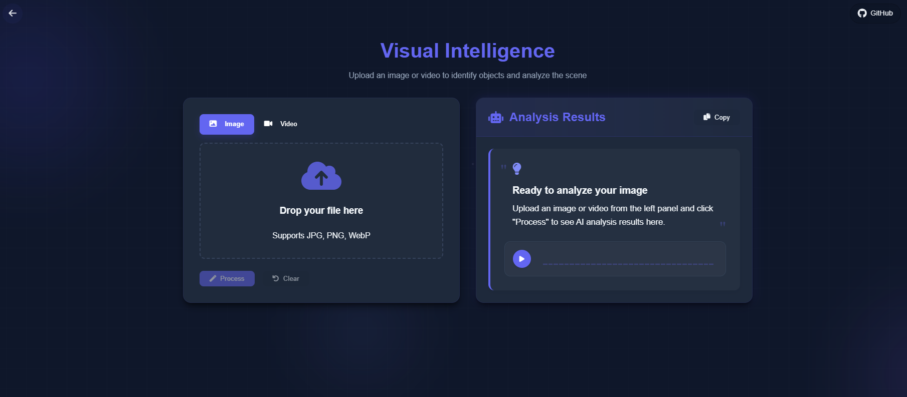
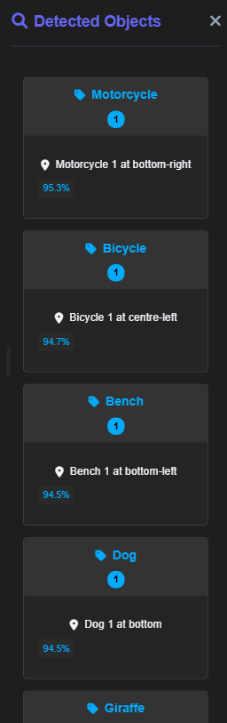
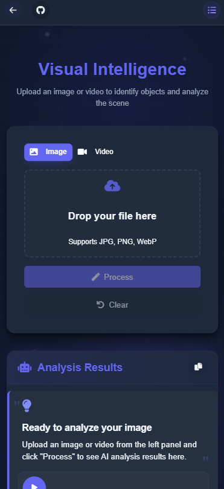

# VIOR API - Video and Image Object Recognition

> **Live Demo**: [examplelink.com](https://myra-vior.onrender.com)
>
> **Note**: The live demo uses a free tier hosting service which might not always produce optimal results due to resource limitations. For a guaranteed experience, please refer to the demo videos and screenshots in this README file.

A FastAPI-based application for object detection in images and videos using YOLOv8.

## Features

- Real-time object detection in images
- Object detection in video files
- Web interface for easy interaction
- RESTful API endpoints
- Support for multiple YOLOv8 models

## Demo

### Screenshots

Here are some screenshots of the application in action:

- Desktop view:
- Object detection results:
- Mobile view:
  

### Demo Video

Check out the demo video to see the application in action:

[Watch Demo Video](https://youtu.be/RNzTktLaMnw)

## Prerequisites

- Python 3.9+
- Docker (optional)

## Installation

### Local Setup

1. Clone the repository:

```bash
git clone https://github.com/ShivanshGhelani/vior.git
cd vior-api
```

2. Install dependencies:

```bash
pip install -r requirements.txt
```

3. Download YOLOv8 model:

```bash
python -c "from ultralytics import YOLO; YOLO('yolov8n.pt')"
```

4. Run the application:

```bash
uvicorn main:app --reload
```

### Docker Setup

1. Build the Docker image:

```bash
docker build -t vior-api .
```

2. Run the container:

```bash
docker run -p 8000:8000 vior-api
```

## Usage

Access the web interface at `http://localhost:8000`

API endpoints:

- `/docs` - Swagger UI documentation
- `/redoc` - ReDoc documentation
- `/detect/image` - Image detection endpoint
- `/detect/video` - Video detection endpoint

## API Documentation

Full API documentation is available at `http://localhost:8000/docs` when running the application.

## Deployment

This application is ready to be deployed on Render. To deploy:

1. Push your code to GitHub
2. Create a new Web Service on Render
3. Connect your GitHub repository
4. Use the following settings:
   - Environment: Docker
   - Build Command: (Docker will handle this)
   - Start Command: (Docker will handle this)

## License

MIT License

Copyright (c) 2025 Shivansh Ghelani

Permission is hereby granted, free of charge, to any person obtaining a copy
of this software and associated documentation files (the "Software"), to deal
in the Software without restriction, including without limitation the rights
to use, copy, modify, merge, publish, distribute, sublicense, and/or sell
copies of the Software, and to permit persons to whom the Software is
furnished to do so, subject to the following conditions:

The above copyright notice and this permission notice shall be included in all
copies or substantial portions of the Software.

THE SOFTWARE IS PROVIDED "AS IS", WITHOUT WARRANTY OF ANY KIND, EXPRESS OR
IMPLIED, INCLUDING BUT NOT LIMITED TO THE WARRANTIES OF MERCHANTABILITY,
FITNESS FOR A PARTICULAR PURPOSE AND NONINFRINGEMENT. IN NO EVENT SHALL THE
AUTHORS OR COPYRIGHT HOLDERS BE LIABLE FOR ANY CLAIM, DAMAGES OR OTHER
LIABILITY, WHETHER IN AN ACTION OF CONTRACT, TORT OR OTHERWISE, ARISING FROM,
OUT OF OR IN CONNECTION WITH THE SOFTWARE OR THE USE OR OTHER DEALINGS IN THE
SOFTWARE.

## Contributing

Contributions are welcome! Please feel free to submit a Pull Request.

---

<p align="center">Made with ❤️ by Shivansh Ghelani</p>
